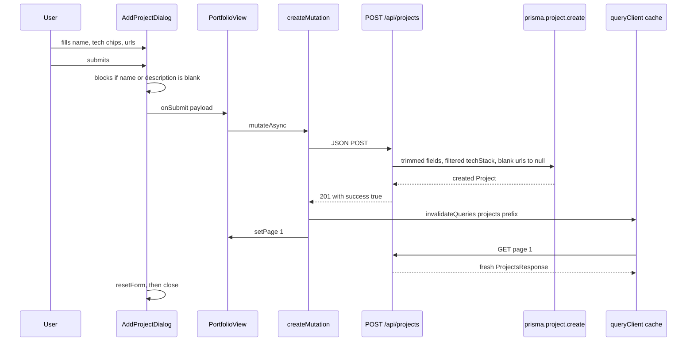
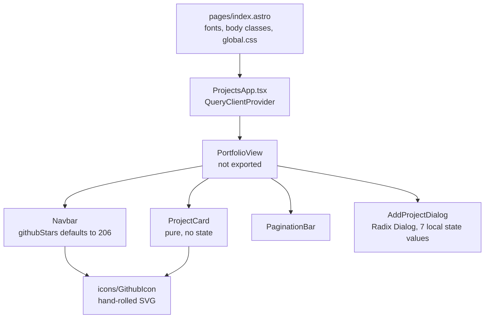

# Konichiwa architecture

Konichiwa is a single-page project portfolio. One Astro page, one API route, one Prisma model, and five React components. There is no auth, no server-side routing, no content collections, and no tests.

The app is an HTML shell wrapped around a single React island. `src/pages/index.astro` fetches nothing in its frontmatter. It emits a document and hydrates `<ProjectsApp client:load />`. Fetching, caching, pagination state, and the add-project form all run in the browser.

The Astro server exists to run `src/pages/api/projects.ts`. Prisma's MongoDB driver needs a long-lived Node process to hold a connection pool, so the build targets `output: 'server'` with the standalone Node adapter instead of a static build. This is an inference. The supporting evidence is that `index.astro` is the only file in `src/pages/` besides the API route, and neither uses a prerender flag.

One consequence shapes the whole codebase. The heading "Things I've Built" never renders on the server. Every page load shows a spinner, then either real cards or six hardcoded seed cards if MongoDB is unreachable or empty.

## How a request flows

`GET /` matches `index.astro`. Its frontmatter runs two imports and no async work, so Astro renders the document in one synchronous pass. The browser receives a body with font links and an island placeholder, and nothing else.

React hydrates `ProjectsApp`, which returns `PortfolioView` inside a `QueryClientProvider`. `PortfolioView` calls `useState(1)` and `useState(false)`, then `useQuery` fires against `/api/projects?page=1&limit=6`. Because the query runs client-side, the first paint is always a `Loader2` spinner.

The `GET` handler reads `page` and `limit` from the query string, floors both at 1 with `Math.max(1, parseInt(...))`, computes `skip`, then runs `prisma.project.findMany({skip, take: limit, orderBy: {createdAt: "desc"}})` and `prisma.project.count()` concurrently under one `Promise.all`. It returns a hand-built `new Response(JSON.stringify(...))` rather than Astro's `Response.json` helper.

Prisma returns `DateTime` values as JavaScript `Date` objects. `JSON.stringify` turns them into ISO strings on the way out, which is why `src/lib/types.ts` types `createdAt` as `string`.

The write path is shorter. The plus button in `Navbar` flips `isAddOpen`, the dialog's `onSubmit` prop calls `createMutation.mutateAsync`, and `onSuccess` invalidates the `["projects"]` query prefix before setting the page to 1.



## The component tree



`ProjectCard`, `PaginationBar`, and `Navbar` take props and render. They hold no state and fetch nothing. `AddProjectDialog` is the only component with its own state beyond the two `useState` calls in `PortfolioView`.

`GithubIcon` is the one hand-rolled icon in the project. Everything else comes from `lucide-react`.

## The data shapes

`Project` exists in two forms, and nothing keeps them in sync.

`prisma/schema.prisma` declares the storage shape. The `id` field is a `String` mapped to MongoDB's `_id` through `@db.ObjectId`. `techStack` is a native MongoDB `String[]`. Both URLs are nullable and `createdAt` defaults to `DateTime @default(now())`.

`src/lib/types.ts` declares the wire shape for the client. The fields match except that `createdAt` is `string` and both URLs accept `null`. Editing the Prisma model will not update the interface, and there is no test or type generation step that catches the drift.

`ProjectsResponse` carries `projects`, `total`, `totalPages`, and `currentPage`. The `error?: string` field is never populated by either handler and never read by the client.

## The two singletons

Both are at module scope, and both are there for the same reason.

`src/lib/prisma.ts` stashes the client on `globalThis` when `NODE_ENV !== "production"`. Astro's dev server re-evaluates modules on every edit, and a fresh `PrismaClient` per reload would open a new Mongo connection pool each time until Atlas refuses the connection. In production Node caches the module, so the stash is skipped.

The `QueryClient` at `src/components/ProjectsApp.tsx:67` sits at module scope for a parallel reason. `client:load` can re-execute the island module, and a `new QueryClient()` in a component body would throw the cache away each time. Its options set `staleTime` to two minutes and `refetchOnWindowFocus` to false, so the grid does not refetch when the tab regains focus.

## Where the fallback comes from

`DEFAULT_PROJECTS` at `src/components/ProjectsApp.tsx:16` holds six hardcoded projects with string ids `"1"` through `"6"`. Their URLs point at `github.com` and `example.com`.

The branch that selects them is `usingFallback = isError || isDbEmpty`, where `isDbEmpty` checks `data?.projects?.length === 0`. It tests for an empty result, not for a missing database. A genuinely empty portfolio renders the same six fake cards as a broken connection.

The amber banner renders on `isError` alone, so an empty portfolio shows seed data with no warning. A user cannot tell the two apart.

## File map

```
astro.config.mjs                  server output, node standalone, react, tailwind vite plugin
tsconfig.json                     astro/tsconfigs/strict, jsx react-jsx, @/* to src/*
prisma/schema.prisma              one Project model on mongodb
.env / .env.example               DATABASE_URL only
src/pages/index.astro             the only page. document shell and one island
src/pages/api/projects.ts         GET and POST. the entire server-side surface
src/lib/prisma.ts                 PrismaClient singleton
src/lib/types.ts                  Project and ProjectsResponse interfaces
src/components/ProjectsApp.tsx    seed data, queryClient, PortfolioView, fallback logic
src/components/Navbar.tsx         header, wordmark, star pill, plus button
src/components/ProjectCard.tsx    one card, no state
src/components/PaginationBar.tsx  dense page buttons with no windowing
src/components/AddProjectDialog.tsx  Radix Dialog, form state, tag chip input
src/components/icons/GithubIcon.tsx  inline SVG github mark
src/styles/global.css             tailwind import plus @layer base body rules
```

`src/pages/api/projects.ts` is the file to read first. It does validation, normalization, database access, and response construction in 80 lines, with no schema check and no test coverage. Everything else in the codebase is a leaf component or a data declaration.

## Known gaps

These are the issues found while reading every source file. Each one names what breaks and for whom.

### The overlay never fades in

`src/components/AddProjectDialog.tsx:87` applies `animate-in fade-in` to the dialog overlay. Those utilities come from `tailwindcss-animate`, which has zero occurrences in `package.json` and zero in `package-lock.json`. Tailwind v4 does not ship them. The overlay appears instantly. Adding the plugin back also requires redeclaring its theme variables.

### The API accepts any URL

`POST /api/projects` normalizes the two URLs with `githubUrl?.trim() || null` and performs no other check. The dialog's inputs use `type="url"`, which is a browser hint and does not run on a request built outside the browser. `ProjectCard.tsx:38` puts the stored string straight into an `href`.

This is a data-integrity gap, not a script-execution one. React 19.3.0 runs `sanitizeURL` on every `href` and rewrites anything matching `javascript:` into a throwing stub, so a hostile URL cannot execute. What remains is that any host can be stored and rendered as a link that looks legitimate.

### Bad query parameters return 500

`Math.max(1, parseInt("abc"))` evaluates to `NaN`, not 1. A request to `/api/projects?page=abc` therefore sets `page` and `skip` to `NaN`, and Prisma throws on a `NaN` argument. The route returns 500 where a 400 belongs. This last step is inferred from Prisma's argument validation, not executed. There is no `Number.isNaN` guard and no upper bound on `limit`, so `/api/projects?limit=100000` is a full collection dump.

### Pagination does nothing while the fallback shows

`totalPages` is hardcoded to 3 when `usingFallback` is true. Clicking page 2 changes the page state, which changes the query key, which refetches, which fails the same way, which reselects the fallback. The cards never change, but the active highlight moves to page 2. To a user this reads as a broken control.

### The page size lives in three places

The value 6 appears in the fetch URL at `src/components/ProjectsApp.tsx:83`, in the server default at `src/pages/api/projects.ts:9`, and in `README.md`. Changing it in two of the three makes the server's `totalPages` calculation disagree with the client's request.

### The 400 message never reaches the user

The POST handler's 400 branch returns `{error: "Project name and description are required."}` with no `details` key. The client at `src/components/ProjectsApp.tsx:101` reads `errData?.details`, finds `undefined`, and falls through to the literal string `"Failed to save project"`. The dialog's own guard at `AddProjectDialog.tsx:60` usually prevents the request from being sent, which is why this went unnoticed.

### Dead code and redundant config

`clsx` and `tailwind-merge` are dependencies that appear nowhere in `src/`. `Plus` and `Sparkles` are imported at `src/components/ProjectsApp.tsx:13` and never rendered. `refetch` is destructured at line 80 and never called, so the amber banner tells the reader to fix `DATABASE_URL` with no retry control beside it. `export const prerender = false` at `src/pages/api/projects.ts:4` changes nothing under `output: 'server'`, where nothing prerenders by default. The dialog resets its form twice on the happy path, once from `handleSubmit` and once from `Dialog.Root`'s `onOpenChange`.

### Accessibility gaps in the dialog

The Radix dialog has a `Dialog.Title` and no `Dialog.Description`, which logs an accessibility warning to the console on every open. No label carries `htmlFor` or a matching `id`, so clicking the "Project Name" text does not focus its input and the inputs have no accessible name.

### The credential is one commit away from leaking

`.env` holds a live `DATABASE_URL` and the project has no `.gitignore`. The directory is not a git repository yet, so nothing has leaked. Create `.gitignore` with `.env`, `node_modules/`, `dist/`, and `.astro/` before the first commit.