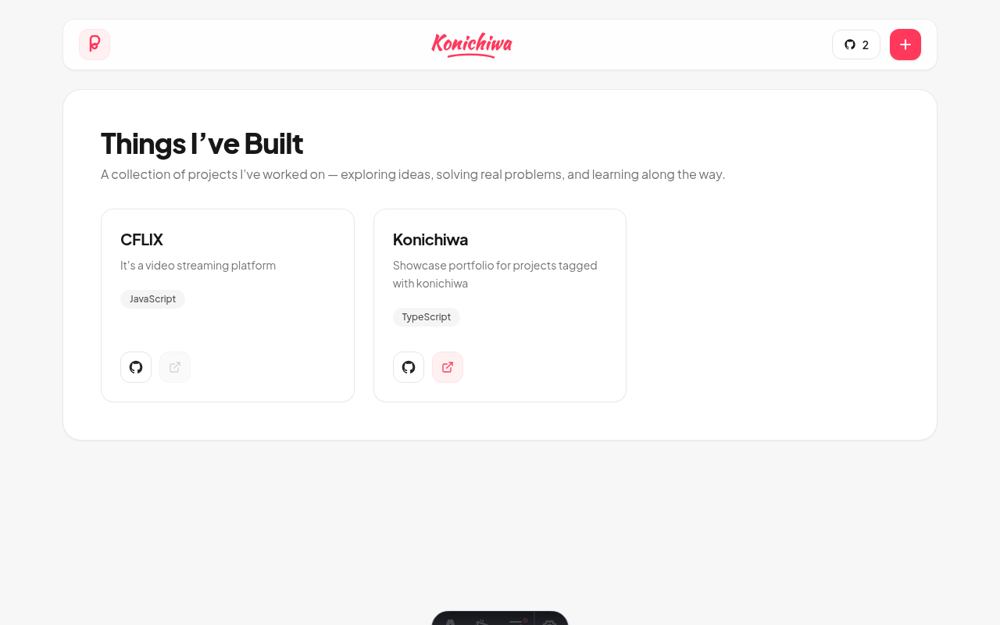
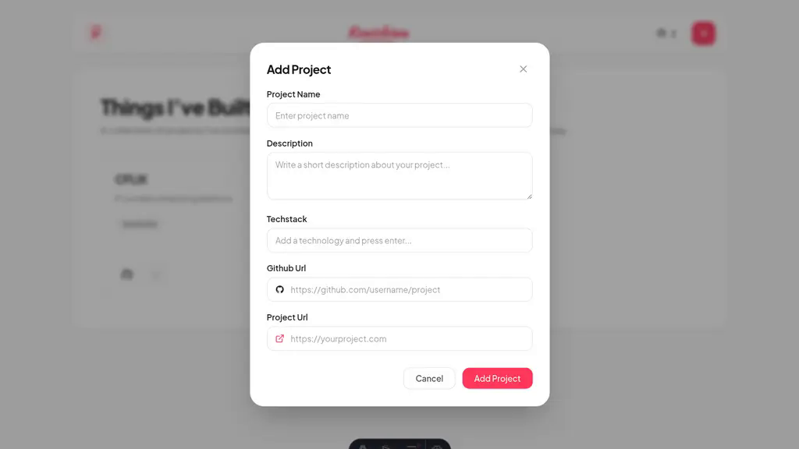

# Konichiwa - Things I've Built

An automated, modern projects portfolio built with **Astro**, **React 19**, **Tailwind CSS**, **Prisma**, and **MongoDB Atlas**, deployed on **Vercel**.

Konichiwa automatically discovers, syncs, and showcases your open-source projects using GitHub topics, complete with an interactive UI, real-time database project counter, and a modal for direct submissions.

---

## Preview

| Portfolio Showcase | Add Project Modal |
| :---: | :---: |
|  |  |

---

## Key Features

- **Automated GitHub Project Sync**: A scheduled GitHub Actions workflow detects any repository tagged with the `konichiwa` topic, fetches its metadata (title, description, website link, and tech stack), and registers it into the database.
- **Dynamic Navbar Counter**: Displays the live total count of projects under Konichiwa directly in the top navigation bar, linking to tagged repositories on GitHub.
- **Clean Scrollbar-Free UI**: Custom utilities hide browser window and modal scrollbars while preserving full trackpad and mouse-wheel scrolling.
- **API Deduplication**: The `POST /api/projects` endpoint matches existing records by `githubUrl` — updating existing projects in-place and preventing duplicate entries.
- **Prisma ORM + MongoDB Atlas**: Fast NoSQL persistence using Prisma 6 with MongoDB ObjectId mapping.
- **Reactive UI with TanStack Query**: Instant client-side updates, caching, and optimistic dialog workflows.
- **Serverless on Vercel**: Powered by `@astrojs/vercel` serverless functions for zero-maintenance hosting.
- **Graceful Offline Fallback**: Automatically displays preview seed cards when database connection is initializing.

---

## Architecture & Data Flow

```mermaid
flowchart LR
    GH[GitHub Repos with topic:konichiwa] -->|Hourly Cron / dispatch| W[GitHub Action: sync-repos.yml]
    W -->|Fetch metadata: name, desc, homepage, topics| S[scripts/sync-conichiwa.js]
    S -->|POST /api/projects| API[Astro API on Vercel]
    API -->|Prisma ORM (dedup by githubUrl)| DB[(MongoDB Atlas)]
    DB -->|GET /api/projects| UI[React / Astro Portfolio UI]
```

---

## Quick Start

### 1. Prerequisites
- **Node.js**: v20+ or v22+
- **MongoDB**: MongoDB Atlas cluster (M0 or higher) or local replica set

### 2. Configure Environment Variables
Copy `.env.example` to `.env`:
```bash
cp .env.example .env
```

Set your MongoDB Atlas connection string. Ensure the database name (e.g. `/konichiwa`) is included:
```env
DATABASE_URL="mongodb+srv://<username>:<password>@cluster0.gfybws5.mongodb.net/konichiwa?retryWrites=true&w=majority&appName=Cluster0"
```

> **Important for Cloud / Vercel Deployments:**
> In your MongoDB Atlas dashboard under **Network Access**, ensure **`0.0.0.0/0` (Allow Access from Anywhere)** is added so Vercel's serverless functions can connect during TLS handshakes.

### 3. Install Dependencies & Generate Prisma Client
```bash
npm install
npm run prisma:generate
```

### 4. Run Development Server
```bash
npm run dev
```
Open [http://localhost:4321](http://localhost:4321) in your browser.

### 5. Build for Production
```bash
npm run build
```

---

## Automated GitHub Sync Setup

To automatically feature any of your GitHub repositories on this portfolio:

1. Navigate to your repository on GitHub.
2. In the repository **About** section (top right):
   - Add the topic: **`konichiwa`**
   - (Optional) Set your live demo link in the **Website** field.
3. The `.github/workflows/sync-repos.yml` workflow runs every hour, or you can trigger it immediately from the **Actions** tab via **Run workflow**.
4. The workflow extracts:
   - **Name**: Repository name.
   - **Description**: Repository description.
   - **Project URL**: The website URL set in the About section.
   - **GitHub URL**: The GitHub repository link.
   - **Tech Stack**: Extracted from languages and topics (excluding `konichiwa`).

---

## Scripts & Commands

| Command | Description |
| :--- | :--- |
| `npm run dev` | Starts local Astro development server on port 4321 |
| `npm run build` | Generates Prisma client and builds serverless bundle for Vercel |
| `npm run preview` | Previews production build locally |
| `npm run prisma:generate` | Generates Prisma Client JavaScript bindings |
| `node scripts/sync-conichiwa.js` | Runs manual GitHub topic sync script locally |

---

## Project Structure

```text
├── assets/                     # Portfolio UI and modal screenshots
├── prisma/
│   └── schema.prisma           # Prisma schema definition for MongoDB
├── scripts/
│   └── sync-conichiwa.js       # GitHub API sync script
├── src/
│   ├── components/
│   │   ├── AddProjectDialog.tsx# Modal dialog for manual project addition
│   │   ├── Navbar.tsx          # Navigation header with dynamic project counter
│   │   ├── PaginationBar.tsx   # Pagination navigation controls
│   │   ├── ProjectCard.tsx     # Project showcase card component
│   │   └── ProjectsApp.tsx     # Main application state and data fetching
│   ├── lib/
│   │   ├── prisma.ts           # Prisma client singleton
│   │   └── types.ts            # TypeScript interfaces
│   ├── pages/
│   │   ├── api/
│   │   │   └── projects.ts     # REST API route (GET, POST with dedup)
│   │   └── index.astro         # Main entry page
│   └── styles/
│       └── global.css          # Tailwind CSS and scrollbar utilities
└── astro.config.mjs            # Astro configuration with Vercel adapter
```

---

## License

MIT
